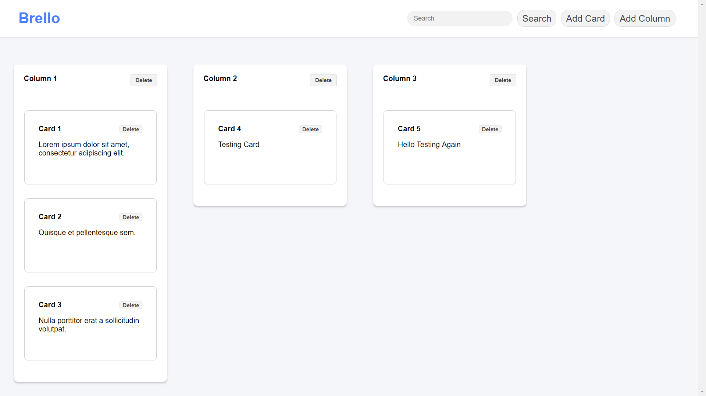

# Brello, A Trello Copycat
Brello is a project for Maltem Test. Creating a trello like application using web components and javascript from scratch.

# Requirements
This project requires the Node.js CLI (https://nodejs.org/en/download/).

## Install and use json-server

1. From node CLI, install json-server and http-server:
```
npm install -g json-server http-server
```

2. Start the server (db.json is located in the materials folder):
```
cd materials
json-server --port 3000 --watch db.json
```

3. From other terminal:
```
cd [project root]
http-server -c-1
```

4. Access the file with the given URL. For example: 
```
http://localhost
```



# Todo list

1. Create a public github repository that you will send to us. ✅
2. For implementation you should and can only use **Web Components**. No frameworks or external libraries can be used for this assessment. ✅
3. You should consume the data of the fake API provided by this repository (see section 'Materials' below). ✅
4. Create a single page that list all columns with their respective cards. ✅
	- Each column is defined by a title and the cards it contains, ✅
	- Each card is defined by a mandatory title, an optional description and the column it belongs to. ✅
5. The user should be able to:
	- display all columns with all cards, ✅
	- create a new card, ✅
	- modify a card, ❌
	- delete a card, ✅
	- add a column, ✅
	- modify a column, ❌
	- delete a column, ✅ 
	- search for any keywords presents on one or multiple cards. The view shall update without reloading the whole page, ❌
	- Drag and drop a card from one column to another, ❌
	- Click on a card to see its description:
		- The description should be in the same view and extend the card container, 
		- It should not open another page or popup/popin. 
6. Cards and columns should be unique (i.e we should not see 2 cards or 2 columns with the same title).✅
7. Explain in simple words how to install and run your project within your README file.✅
8. Send the link of your github repository for reviewing to [tgcorbeaux@maltem.com](mailto:tgcorbeaux@maltem.com).✅

  